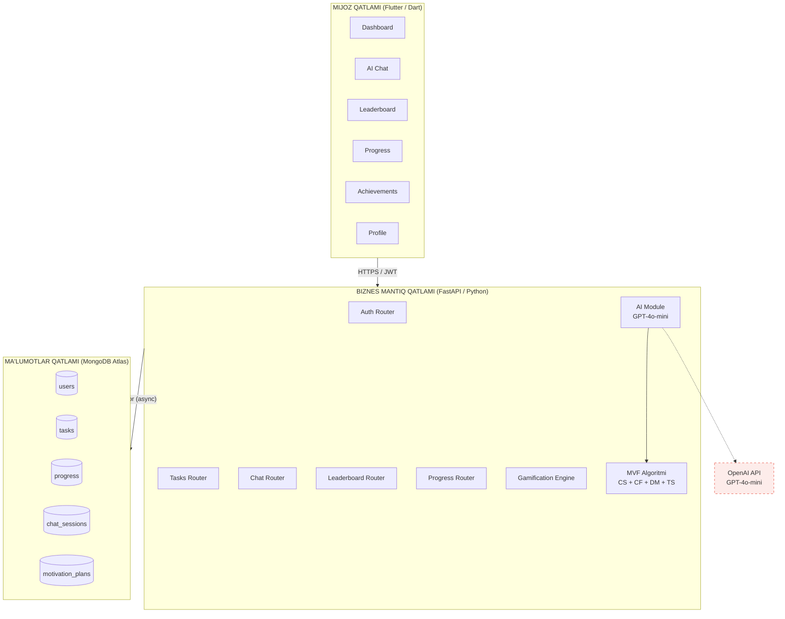

# 3-Pog'onali Arxitektura (Three-Tier Architecture)

```mermaid
flowchart TB
    subgraph MIJOZ["MIJOZ QATLAMI (Flutter / Dart)"]
        direction LR
        D1[Dashboard]
        D2[AI Chat]
        D3[Leaderboard]
        D4[Progress]
        D5[Achievements]
        D6[Profile]
    end

    subgraph BIZNES["BIZNES MANTIQ QATLAMI (FastAPI / Python)"]
        direction LR
        B1[Auth Router]
        B2[Tasks Router]
        B3[Chat Router]
        B4[Leaderboard Router]
        B5[Progress Router]
        B6[AI Module<br/>GPT-4o-mini]
        B7[Gamification Engine]
        MVF[MVF Algoritmi<br/>CS + CF + DM + TS]
    end

    subgraph DATA["MA'LUMOTLAR QATLAMI (MongoDB Atlas)"]
        direction LR
        M1[(users)]
        M2[(tasks)]
        M3[(progress)]
        M4[(chat_sessions)]
        M5[(motivation_plans)]
    end

    OPENAI[OpenAI API<br/>GPT-4o-mini]:::external

    MIJOZ -- "HTTPS / JWT" --> BIZNES
    BIZNES -- "Motor (async)" --> DATA
    B6 -.-> OPENAI
    B6 --> MVF

    classDef external stroke-dasharray: 5 5,stroke:#e74c3c,fill:#fdecea
```
