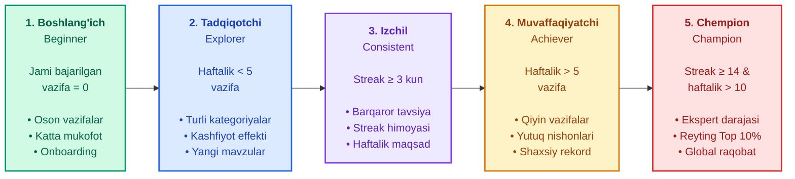

# Gamifikatsiya — 5 ta foydalanuvchi darajasi

```mermaid
flowchart LR
    L1["<b>1. Boshlang'ich</b><br/>Beginner<br/><br/>Jami bajarilgan<br/>vazifa = 0<br/><br/>• Oson vazifalar<br/>• Katta mukofot<br/>• Onboarding"]:::beginner

    L2["<b>2. Tadqiqotchi</b><br/>Explorer<br/><br/>Haftalik &lt; 5<br/>vazifa<br/><br/>• Turli kategoriyalar<br/>• Kashfiyot effekti<br/>• Yangi mavzular"]:::explorer

    L3["<b>3. Izchil</b><br/>Consistent<br/><br/>Streak ≥ 3 kun<br/><br/>• Barqaror tavsiya<br/>• Streak himoyasi<br/>• Haftalik maqsad"]:::consistent

    L4["<b>4. Muvaffaqiyatchi</b><br/>Achiever<br/><br/>Haftalik &gt; 5<br/>vazifa<br/><br/>• Qiyin vazifalar<br/>• Yutuq nishonlari<br/>• Shaxsiy rekord"]:::achiever

    L5["<b>5. Chempion</b><br/>Champion<br/><br/>Streak ≥ 14 &amp;<br/>haftalik &gt; 10<br/><br/>• Ekspert darajasi<br/>• Reyting Top 10%<br/>• Global raqobat"]:::champion

    L1 --> L2 --> L3 --> L4 --> L5

    classDef beginner   fill:#d1fae5,stroke:#059669,color:#065f46,stroke-width:2px
    classDef explorer   fill:#dbeafe,stroke:#2563eb,color:#1e40af,stroke-width:2px
    classDef consistent fill:#ede9fe,stroke:#7c3aed,color:#5b21b6,stroke-width:2px
    classDef achiever   fill:#fef3c7,stroke:#d97706,color:#92400e,stroke-width:2px
    classDef champion   fill:#fee2e2,stroke:#dc2626,color:#991b1b,stroke-width:2px
```
