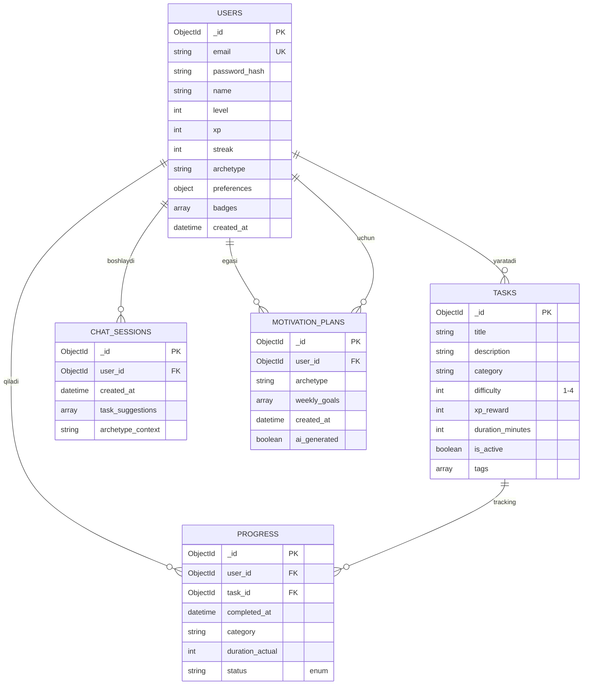

# MongoDB Atlas Ma'lumotlar Bazasi Sxemasi (5 ta asosiy kolleksiya)

```mermaid
erDiagram
    USERS ||--o{ TASKS : "yaratadi"
    USERS ||--o{ PROGRESS : "qiladi"
    USERS ||--o{ CHAT_SESSIONS : "boshlaydi"
    USERS ||--o{ MOTIVATION_PLANS : "egasi"
    TASKS ||--o{ PROGRESS : "tracking"
    MOTIVATION_PLANS }o--|| USERS : "uchun"

    USERS {
        ObjectId _id PK
        string email UK
        string password_hash
        string name
        int level
        int xp
        int streak
        string archetype
        object preferences
        array badges
        datetime created_at
    }

    TASKS {
        ObjectId _id PK
        string title
        string description
        string category
        int difficulty "1-4"
        int xp_reward
        int duration_minutes
        boolean is_active
        array tags
    }

    PROGRESS {
        ObjectId _id PK
        ObjectId user_id FK
        ObjectId task_id FK
        datetime completed_at
        string category
        int duration_actual
        string status "enum"
    }

    CHAT_SESSIONS {
        ObjectId _id PK
        ObjectId user_id FK
        datetime created_at
        array task_suggestions
        string archetype_context
    }

    MOTIVATION_PLANS {
        ObjectId _id PK
        ObjectId user_id FK
        string archetype
        array weekly_goals
        datetime created_at
        boolean ai_generated
    }
```

**Indekslar:** `email` (unique), `xp` (desc), `user_id + completed_at` (compound)
