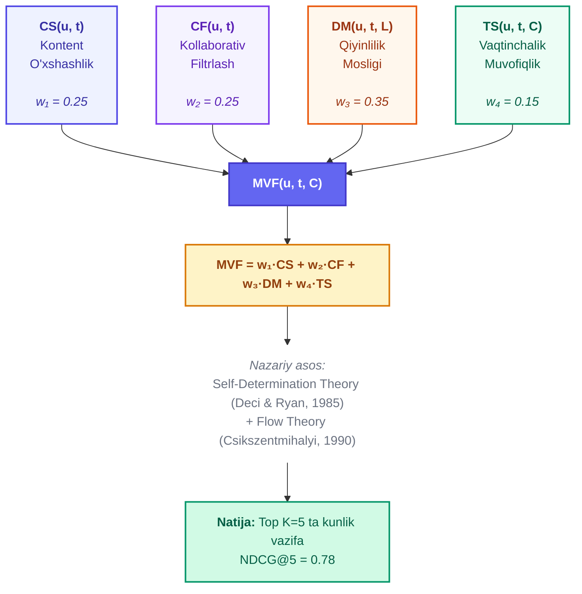

# Motivatsional Qiymat Funksiyasi (MVF) — to'rt komponentli gibrid model

```mermaid
flowchart TB
    CS["<b>CS(u, t)</b><br/>Kontent<br/>O'xshashlik<br/><br/><i>w₁ = 0.25</i>"]:::cs
    CF["<b>CF(u, t)</b><br/>Kollaborativ<br/>Filtrlash<br/><br/><i>w₂ = 0.25</i>"]:::cf
    DM["<b>DM(u, t, L)</b><br/>Qiyinlilik<br/>Mosligi<br/><br/><i>w₃ = 0.35</i>"]:::dm
    TS["<b>TS(u, t, C)</b><br/>Vaqtinchalik<br/>Muvofiqlik<br/><br/><i>w₄ = 0.15</i>"]:::ts

    MVF["<b>MVF(u, t, C)</b>"]:::mvf

    F["<b>MVF = w₁·CS + w₂·CF + w₃·DM + w₄·TS</b>"]:::formula

    THEORY["<i>Nazariy asos:</i><br/>Self-Determination Theory (Deci &amp; Ryan, 1985)<br/>+ Flow Theory (Csikszentmihalyi, 1990)"]:::theory

    RESULT["<b>Natija:</b> Top K=5 ta kunlik vazifa<br/>NDCG@5 = 0.78"]:::result

    CS --> MVF
    CF --> MVF
    DM --> MVF
    TS --> MVF
    MVF --> F
    F --> THEORY
    THEORY --> RESULT

    classDef cs      fill:#eef2ff,stroke:#4f46e5,color:#3730a3,stroke-width:2px
    classDef cf      fill:#f5f3ff,stroke:#7c3aed,color:#5b21b6,stroke-width:2px
    classDef dm      fill:#fff7ed,stroke:#ea580c,color:#9a3412,stroke-width:2px
    classDef ts      fill:#ecfdf5,stroke:#059669,color:#065f46,stroke-width:2px
    classDef mvf     fill:#6366f1,stroke:#4338ca,color:#ffffff,stroke-width:2px
    classDef formula fill:#fef3c7,stroke:#d97706,color:#92400e,stroke-width:2px
    classDef theory  fill:none,stroke:none,color:#6b7280
    classDef result  fill:#d1fae5,stroke:#059669,color:#065f46,stroke-width:2px
```
