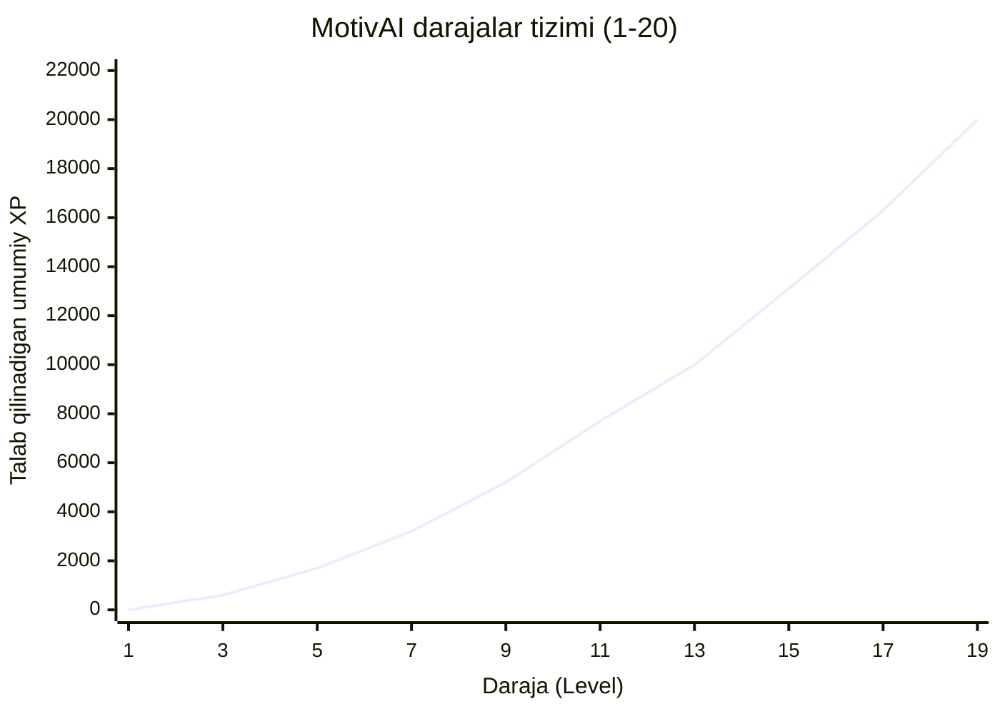
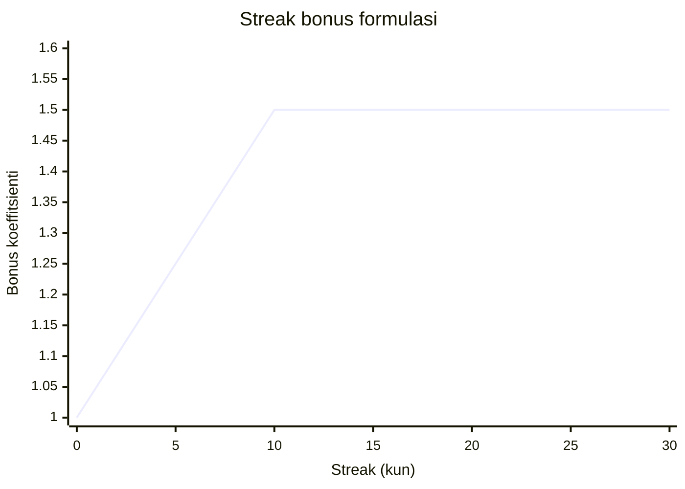

# XP Darajalar Egri Chizig'i va Streak Bonus Formulasi

## XP Talab Qiluvchi Daraja (1–20)

**Daraja nomlari:**
- Level 1 — Yangi boshlovchi (0 XP)
- Level 5 — Intiluvchan (~1700 XP)
- Level 10 — Tirishqoq (~6300 XP)
- Level 15 — Mahoratli (~13100 XP)
- Level 20 — Akademik usto (~22000 XP)

---

## Streak Bonus Koeffitsienti

**Formula:** `SB(s) = min(1.5, 1 + 0.05·s)`

- 0–10 kun: chiziqli o'sish (1.0 → 1.5x)
- 10+ kun: maksimum 1.5x da to'xtaydi
