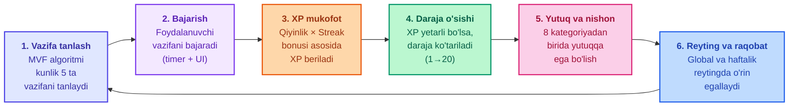

# Foydalanuvchi Tajriba Tsikli (User Flow)

```mermaid
flowchart LR
    P1["<b>1. Vazifa tanlash</b><br/>MVF algoritmi<br/>kunlik 5 ta<br/>vazifani tanlaydi"]:::pick
    P2["<b>2. Bajarish</b><br/>Foydalanuvchi<br/>vazifani bajaradi<br/>(timer + UI)"]:::do
    P3["<b>3. XP mukofot</b><br/>Qiyinlik × Streak<br/>bonusi asosida<br/>XP beriladi"]:::xp
    P4["<b>4. Daraja o'sishi</b><br/>XP yetarli bo'lsa,<br/>daraja ko'tariladi<br/>(1→20)"]:::level
    P5["<b>5. Yutuq va nishon</b><br/>8 kategoriyadan<br/>birida yutuqqa<br/>ega bo'lish"]:::badge
    P6["<b>6. Reyting va raqobat</b><br/>Global va haftalik<br/>reytingda o'rin<br/>egallaydi"]:::rank

    P1 --> P2 --> P3 --> P4 --> P5 --> P6 --> P1

    classDef pick  fill:#e0e7ff,stroke:#4f46e5,color:#3730a3,stroke-width:2px
    classDef do    fill:#f3e8ff,stroke:#7c3aed,color:#5b21b6,stroke-width:2px
    classDef xp    fill:#fed7aa,stroke:#ea580c,color:#9a3412,stroke-width:2px
    classDef level fill:#bbf7d0,stroke:#059669,color:#065f46,stroke-width:2px
    classDef badge fill:#fbcfe8,stroke:#db2777,color:#9f1239,stroke-width:2px
    classDef rank  fill:#bfdbfe,stroke:#2563eb,color:#1e40af,stroke-width:2px
```
