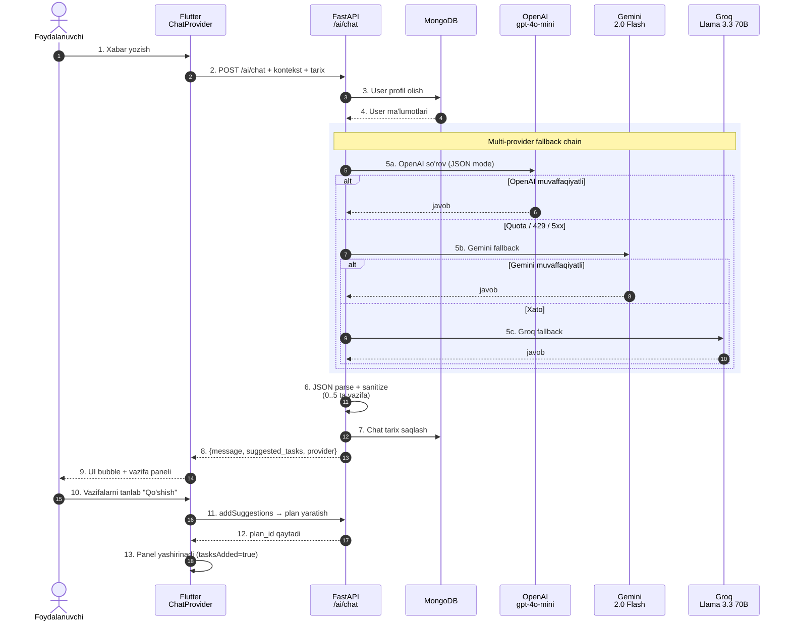

# AI Chat — Sequence Diagram

```mermaid
sequenceDiagram
    autonumber
    actor U as Foydalanuvchi
    participant FL as Flutter<br/>ChatProvider
    participant API as FastAPI<br/>/ai/chat
    participant DB as MongoDB
    participant P1 as OpenAI<br/>gpt-4o-mini
    participant P2 as Gemini<br/>2.0 Flash
    participant P3 as Groq<br/>Llama 3.3 70B

    U->>FL: 1. Xabar yozish
    FL->>API: 2. POST /ai/chat + kontekst + tarix
    API->>DB: 3. User profil olish
    DB-->>API: 4. User ma'lumotlari

    rect rgb(238, 242, 255)
        Note over API,P3: Multi-provider fallback chain
        API->>P1: 5a. OpenAI so'rov (JSON mode)
        alt OpenAI muvaffaqiyatli
            P1-->>API: javob
        else Quota / 429 / 5xx
            API->>P2: 5b. Gemini fallback
            alt Gemini muvaffaqiyatli
                P2-->>API: javob
            else Xato
                API->>P3: 5c. Groq fallback
                P3-->>API: javob
            end
        end
    end

    API->>API: 6. JSON parse + sanitize<br/>(0..5 ta vazifa)
    API->>DB: 7. Chat tarix saqlash
    API-->>FL: 8. {message, suggested_tasks, provider}
    FL-->>U: 9. UI bubble + vazifa paneli
    U->>FL: 10. Vazifalarni tanlab "Qo'shish"
    FL->>API: 11. addSuggestions → plan yaratish
    API-->>FL: 12. plan_id qaytadi
    FL->>FL: 13. Panel yashirinadi (tasksAdded=true)
```
