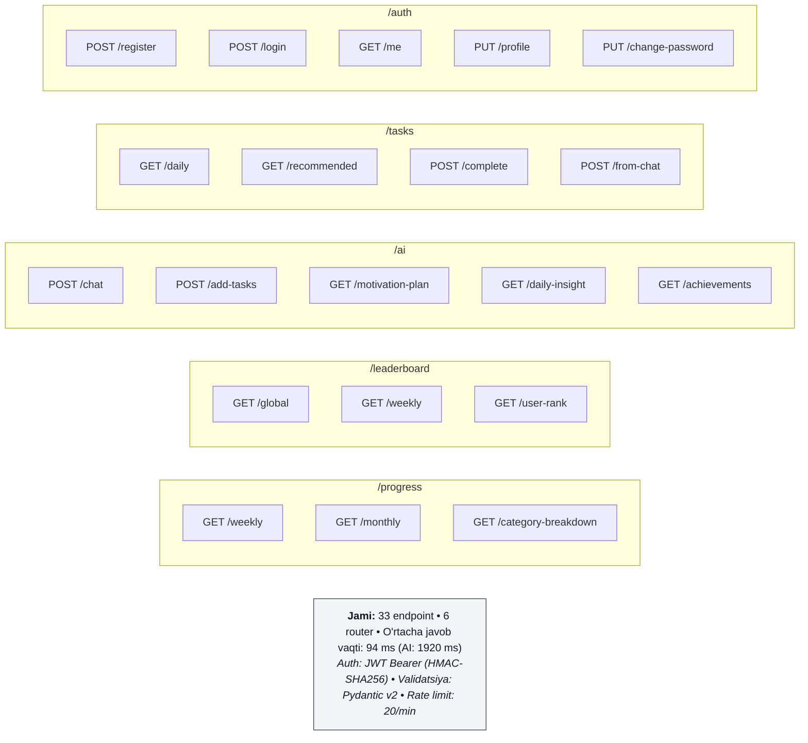

# MotivAI RESTful API Endpoint Xaritasi

```mermaid
flowchart TB
    subgraph AUTH["/auth"]
        direction TB
        A1[POST /register]
        A2[POST /login]
        A3[GET /me]
        A4[PUT /profile]
        A5[PUT /change-password]
    end

    subgraph TASKS["/tasks"]
        direction TB
        T1[GET /daily]
        T2[GET /recommended]
        T3[POST /complete]
        T4[POST /from-chat]
    end

    subgraph AI["/ai"]
        direction TB
        AI1[POST /chat]
        AI2[POST /add-tasks]
        AI3[GET /motivation-plan]
        AI4[GET /daily-insight]
        AI5[GET /achievements]
    end

    subgraph LB["/leaderboard"]
        direction TB
        L1[GET /global]
        L2[GET /weekly]
        L3[GET /user-rank]
    end

    subgraph PROG["/progress"]
        direction TB
        P1[GET /weekly]
        P2[GET /monthly]
        P3[GET /category-breakdown]
    end

    META["<b>Jami:</b> 33 endpoint • 6 router • O'rtacha javob vaqti: 94 ms (AI: 1920 ms)<br/><i>Auth: JWT Bearer (HMAC-SHA256) • Validatsiya: Pydantic v2 • Rate limit: 20/min</i>"]:::meta

    AUTH ~~~ TASKS ~~~ AI ~~~ LB ~~~ PROG
    PROG ~~~ META

    classDef meta fill:#f3f4f6,stroke:#374151,color:#111827,stroke-width:1px
```
