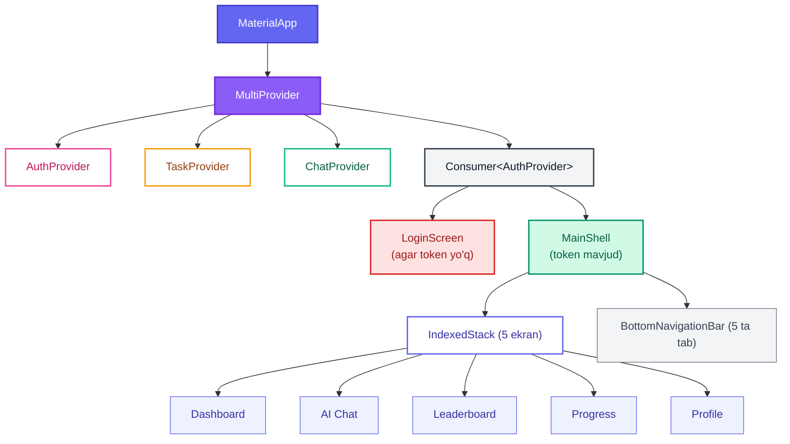

# MotivAI Flutter Widget Daraxti

```mermaid
flowchart TB
    APP[MaterialApp]:::root
    MP[MultiProvider]:::provider

    AUTH[AuthProvider]:::auth
    TASK[TaskProvider]:::task
    CHAT[ChatProvider]:::chat

    CONS["Consumer&lt;AuthProvider&gt;"]:::cons
    LOGIN["LoginScreen<br/>(agar token yo'q)"]:::login
    SHELL["MainShell<br/>(token mavjud)"]:::shell
    STACK["IndexedStack (5 ekran)"]:::stack
    NAV["BottomNavigationBar (5 ta tab)"]:::nav

    S1[Dashboard]:::screen
    S2[AI Chat]:::screen
    S3[Leaderboard]:::screen
    S4[Progress]:::screen
    S5[Profile]:::screen

    APP --> MP
    MP --> AUTH
    MP --> TASK
    MP --> CHAT
    MP --> CONS
    CONS --> LOGIN
    CONS --> SHELL
    SHELL --> STACK
    STACK --> S1 & S2 & S3 & S4 & S5
    SHELL --> NAV

    classDef root     fill:#6366f1,stroke:#4338ca,color:#ffffff,stroke-width:2px
    classDef provider fill:#8b5cf6,stroke:#6d28d9,color:#ffffff,stroke-width:2px
    classDef auth     fill:#fff,stroke:#ec4899,color:#be185d,stroke-width:2px
    classDef task     fill:#fff,stroke:#f59e0b,color:#92400e,stroke-width:2px
    classDef chat     fill:#fff,stroke:#10b981,color:#065f46,stroke-width:2px
    classDef cons     fill:#f3f4f6,stroke:#374151,color:#111827,stroke-width:2px
    classDef login    fill:#fee2e2,stroke:#dc2626,color:#991b1b,stroke-width:2px
    classDef shell    fill:#d1fae5,stroke:#059669,color:#065f46,stroke-width:2px
    classDef stack    fill:#fff,stroke:#6366f1,color:#3730a3,stroke-width:2px
    classDef nav      fill:#f3f4f6,stroke:#6b7280,color:#374151,stroke-width:1px
    classDef screen   fill:#eef2ff,stroke:#6366f1,color:#3730a3,stroke-width:1px
```
