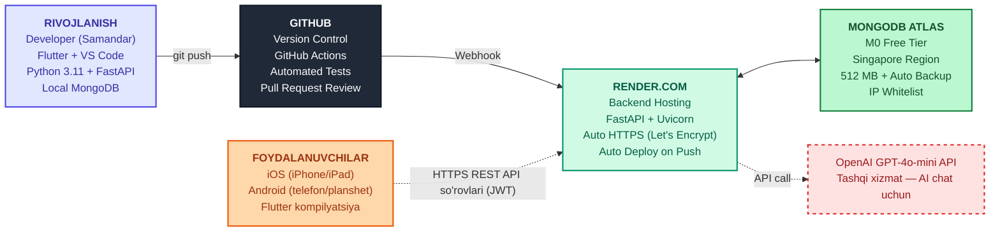

# Deployment Infratuzilmasi

```mermaid
flowchart LR
    DEV["<b>RIVOJLANISH</b><br/>Developer (Samandar)<br/>Flutter + VS Code<br/>Python 3.11 + FastAPI<br/>Local MongoDB"]:::dev

    GH["<b>GITHUB</b><br/>Version Control<br/>GitHub Actions<br/>Automated Tests<br/>Pull Request Review"]:::github

    REND["<b>RENDER.COM</b><br/>Backend Hosting<br/>FastAPI + Uvicorn<br/>Auto HTTPS (Let's Encrypt)<br/>Auto Deploy on Push"]:::render

    MDB["<b>MONGODB ATLAS</b><br/>M0 Free Tier<br/>Singapore Region<br/>512 MB + Auto Backup<br/>IP Whitelist"]:::mongo

    USERS["<b>FOYDALANUVCHILAR</b><br/>iOS (iPhone/iPad)<br/>Android (telefon/planshet)<br/>Flutter kompilyatsiya"]:::users

    OAI["OpenAI GPT-4o-mini API<br/>Tashqi xizmat — AI chat uchun"]:::external

    DEV -- "git push" --> GH
    GH -- "Webhook" --> REND
    REND <--> MDB
    USERS -. "HTTPS REST API so'rovlari (JWT)" .-> REND
    REND -. "API call" .-> OAI

    classDef dev    fill:#e0e7ff,stroke:#4f46e5,color:#3730a3,stroke-width:2px
    classDef github fill:#1f2937,stroke:#111827,color:#f9fafb,stroke-width:2px
    classDef render fill:#d1fae5,stroke:#059669,color:#065f46,stroke-width:2px
    classDef mongo  fill:#bbf7d0,stroke:#15803d,color:#14532d,stroke-width:2px
    classDef users  fill:#fed7aa,stroke:#ea580c,color:#9a3412,stroke-width:2px
    classDef external fill:#fee2e2,stroke:#dc2626,color:#991b1b,stroke-dasharray: 5 5,stroke-width:2px
```
