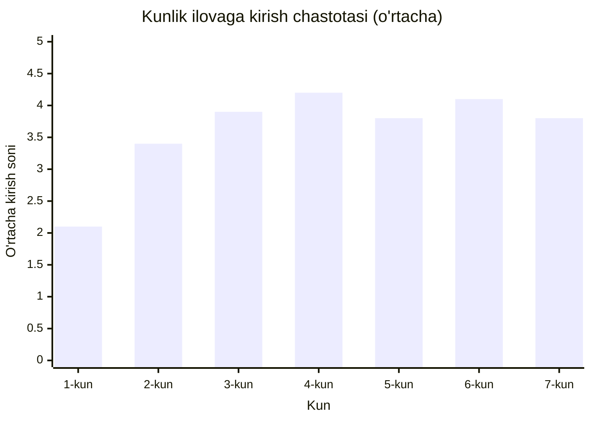

# Sinov Ko'rsatkichlari

## Kunlik Ilovaga Kirish Chastotasi (n=15, 7 kun)

**Soha standarti:** ≥ 2 marta/kun. MotivAI: 2-kundan boshlab standartdan yuqori.

---

## MotivAI vs Soha Standarti — UX Ko'rsatkichlari

```mermaid
xychart-beta
    title "MotivAI sinov natijalari va soha standarti"
    x-axis ["SUS bali", "NPS", "Ilovani o'rganish", "Bajarish foizi", "AI chat foydaliligi"]
    y-axis "Ko'rsatkich qiymati" 0 --> 90
    bar "MotivAI"      [79.4, 42, 58, 67, 81]
    bar "Soha standarti" [68, 30, 58, 50, 70]
```

| Ko'rsatkich | MotivAI | Soha | Farq |
|---|---|---|---|
| SUS bali | 79.4 | 68 | +11.4 |
| NPS | 42 | 30 | +12 |
| Ilovani o'rganish | 58 | 58 | 0 |
| Bajarish foizi | 67 | 50 | +17 |
| AI chat foydaliligi | 81 | 70 | +11 |
